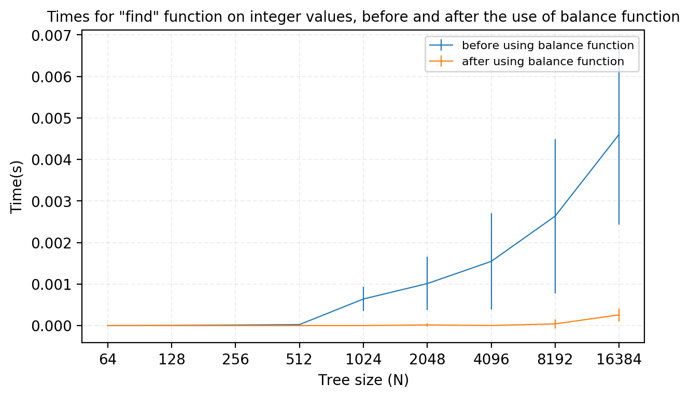
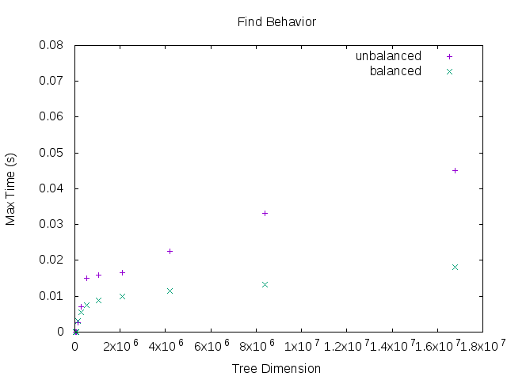
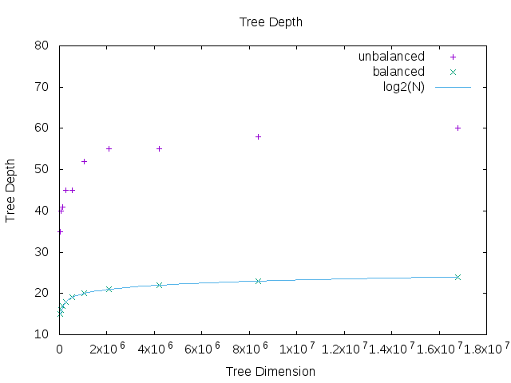

# Binary Search Tree report

The aim of this exam was to implement and test a Binary Search Tree in the c++ language.
We organized our project dividing it into two main parts: the first part concerns the code implementation; we divided the code into an header, "btree.h", located inside the "include" folder, in which are defined and implemented the classes BTree and its component, and a source file "btree.cc", located inside the "src" folder, in which the longer functions are implemented.
The second part concerns the code testing, for which we wrote the file "main_test.cc" where we checked the correctness of the code using different variable types, and the files contained inside the "test" folder, where we took tests to check the behavior of the time for the lookup inside the tree.

## The Code

The Binary Search Tree is templated both on the values of the data it will contain and on the keys that will be used for retrieving them. Also the comparison operation between the keys is templated, allowing to use also custom-made types, but by default this operation is initialized to _std::less<TK>_ function, being TK the template of the key. The primary componenet of the tree is the class BNode, defined inside the BTree class, so that it is visible only to it.
Let's discuss its composition first:

## BNode components

All the BNode components are templated on the key type, the value type and the comparison operation, as the BTree. A BNode contains:
- an _std::pair_ that contains the key and the associated value;
- two BNode _unique\_ptr_ to the left and right childs;
- a raw pointer to the next node, where by this we mean next according to the key values and the comparison operator used; this member is mostly used by the Iterator class discussed later.

By using this simple structure the only data needed inside the tree is the _unique\_ptr_ to the first node inserted, which is called root.
We defined two different constructors for the BNode class:
- one which requires only the insertion of an _std::pair_, used only to create the root node (for which the _next_ is _nullptr_);
- one which requires a _std::pair_ and a pointer to the next node, needed to construct all following nodes.
The BNode class contains some private methods which are mostly recursive and are called by the other BTree methods, used for example to insert a new node or to copy the tree. There are no BNode public methods.

## BTree components

Inside the BTree class we defined and implemented the following data members:
- a BNode _unique\_ptr_ to the root, as already said;
- an instance of the comparison operator;
- a BTree default empty constructor;
- a BTree constructor which needs an _std::pair_ (to set the root node) and a comparions operator, which for the moment is set to the default _std::less<TK>_, where TK is the template for the key;
- the BTree destructor; which is implemented inside the source file.
The Btree is provided with a copy semantic (copy constructor and copy assignment), which copies the tree using the BNode recursive function _copy\_node_, and a BTree move constructor and move assignment, which instead make use the built-in function _std::move()_.
Inside the header we defined also a struct comparison, which represent the comparison operator between two templated keys; there are then different public BTree functions which are then developed inside the source file.

## Iterators

Inside the BTree we defined the classes Iterator and ConstIterator; these objects contain a pointer to BNode and thanks to their methods they can be used to access every element of the tree in order, starting from the leftmost node (which is the one with the smallest key value) and incrementing until the end of the tree.
The Iterator pointer can be moved to the next node with the overloaded operators _operator++()_ and _operator++(int)_, and the data it points to, i.e. the _std::pair_, can be accessed by reference with the overloaded _operator*()_.
Others operator overloads (==, !=) allows the user to compare Iterators between them; these boolean functions simply compare the BNode pointer of the two Iterators.
The BTree class is provided with the functions begin() and end(), which return respectively an Iterator to the leftmost node of the tree and an Itereator whose pointer is set to nullptr, the last one represent the end of the tree. The class ConstIterator is derived from the Iterator one, so has all its data and methods, but of course with the difference that now the dereference operator (_operator*()_) is declared _const_. For this class there are also two functions _cbegin()_ and _cend()_ that do the same job of their non-const counterparts.

The BTree functions developed inside the source file are the following:

- _insert(std::pair<TK,TV>)_: a function used to insert a new BNode given a new key-value pair, this is only an interface for the recursive method _insert\_node_ that does all the job starting from the root node. This last function takes also care of initializing properly the pointer to the _next_ node, that depends only on the direction the new node is inserted. If the value of the key is already present in the tree the function prints a message and reset the second element of the pair to the new value.
- _measure\_depth()_: a function which returns an integer with the maximal depth of the tree, uses the recursive method _measure\_depth_ of BNode;
- _clear()_: function which deletes the tree, and which is called also by the tree destructor;
- _print()_: a function which prints out the tree following the order of the keys (using the ConstIterator);
- _balance()_: a function which balances the tree. We decided to implement it storing the tree pairs key-value in a vector traversing the tree in order, then emptying the tree using clear(), and then refilling it in a recursive way using a BTree private function _built\_tree()_. The _built\_tree()_ is a recursive function which needs a vector reference, a starting and an ending point, and searches everytime the middle point of the given vector to insert it inside the tree.
- _is\_balanced()_: a functions that checks if the tree is balanced computing recursively the difference of the sub-trees depth.
- _find(TK)_ is the function that returns an Iterator to the node with the given key, there is also a constant counterpart, the function _cfind()_ which returns a ConstIterator. Both this functions start their research from the root node and recursively descend the tree untill they found the correct node. If they cannot find the passed key, the Iterator they return is initializated with the _nullptr_.
- _erase(TK)_: a function which deletes only the node with the given key.

The code we wrote is documented with doxygen, through the makefile you can easily obtain a latex and a html documentation for all the classes and methods implemented; to obtain it just run 'make doc'

## Run and test the Code

To test the correctness of the implemented code, first of all we wrote a file _main\_test.cc_, to check the implemented functions using various types for keys and values. Inside the file you can find some functions that are made to check:
- the constructor, destructor and print functions of the tree;
- the copy-move sematics;
- the find function;
- the balance function;
- the erase function;

This file is compiled with the option -D DEBUG, that makes all the main function print on the console some lines which allows to understand what is going on. This program should be also run under the supervision of the _valgrind_ tool, with the option '--tool=memcheck' to check that there are no memory problems during the execution.

In the folder "test" two main files we used to check the trend of the time spent by the code to find a key inside the tree before and after using the balance function on it.
We know that in the worst case we expect that the algorithm to find a key has a time complexity of O(N), while after the balance of the tree we expect a trend like O(log N), where N is the tree size. To perform the test we tried also to compile the code with the -O0 option to avoid the insertion of any compiler optimization.
At the beginning we performed some tests on our laptops, but to be able to use trees of really big sizes we decided to ask for the help of OpenMP, parallelizing our code and running it on Ulysses cluster.
Using OpenMP we created different threads (generally 20, as Ulysses' cores) and we made each one of them search for the maximum time spent for the lookup inside the tree; then we used those values to obtain a mean lookup time.

In the program testlog.cc you can find a test made to measure the time spent by the function _find(TK)_ to search inside a tree composed of integer values. The file uses randomly generated trees of power of two, from 2^6 to 2^14; and searches the kay values from a vector of dimension which is half of the tree one. The program, as already said, uses OpenMP, computing the mean times for the maximum research, made an average on the time of every thread. Then, to have more values on which to compute a mean, the program was ran more than once, and were computed mean times and errors. You can notice from the graphs that the behavoir of the timings is much better after using the balance function, thought it doesn't seem at all logarithmic. Furthermore, the values for a single tree size oscillated a lot.

The program testlognikOMP.cc measure the maximal time spent by the function _find(TK)_ to search for all the possible keys inside trees with a dimension that goes from 2^15 - 1 to 2^24 - 1. The keys for these trees are randomly generated strings with 100 characters, this is to minimize the occurence of two identical keys, a thing that can decrease the tree size. For each tree the maximal lookup time is measured as many time as are the threads in the openMP environment. The program measure both the lookup time and the depht of the tree before and after the call to the balance function, for the former it computes the mean since we observed that otherwise the results can vary a lot for the same identical tree. A graph of these results can be found below. As we can see in both the cases the time follows a logarithmic curve but when the tree is balanced the time is shorter. Looking at the second graph, the one with the depth of the tree, we can observe that for a randomly generated tree the depth also follows a logarithmic trend while, as expected, for the balanced tree the base 2 logarithm function perfectly fits all the points (this is a consequence of the tree dimension choice). 

